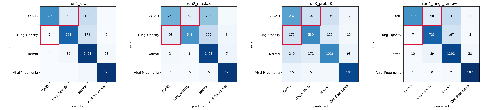
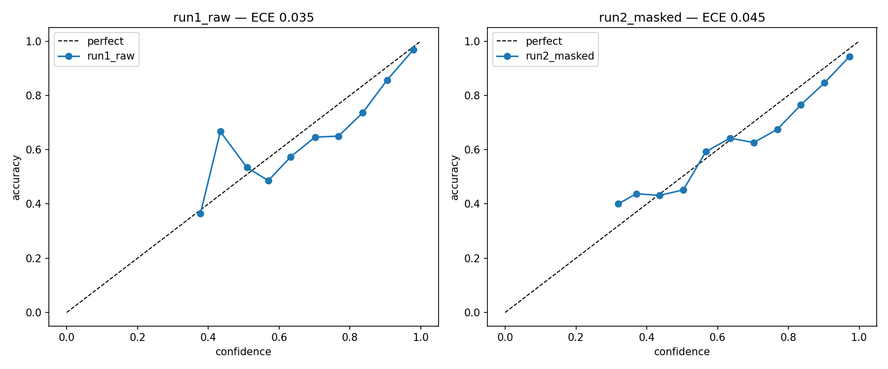
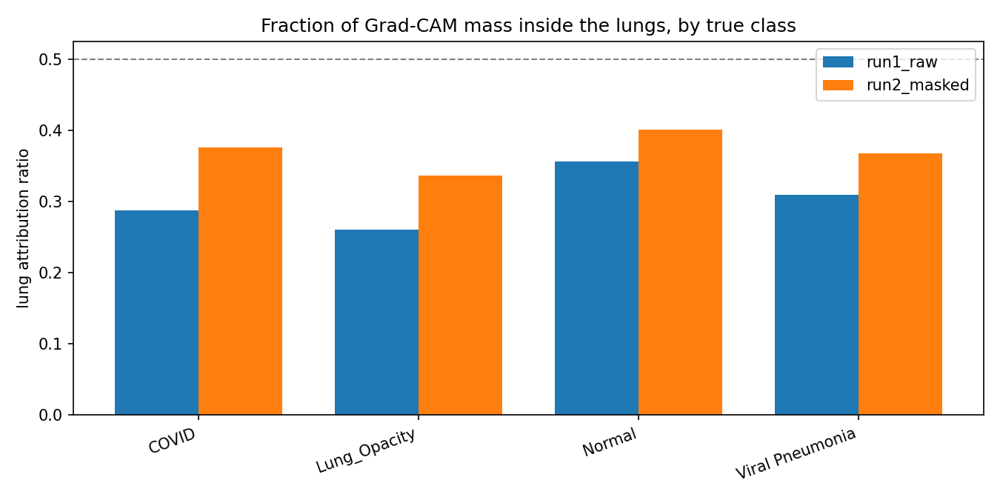
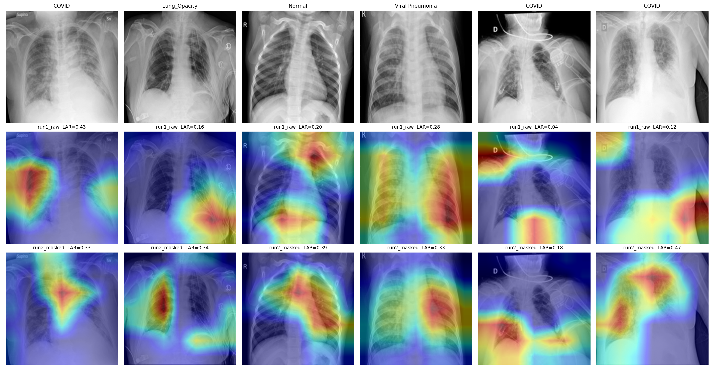
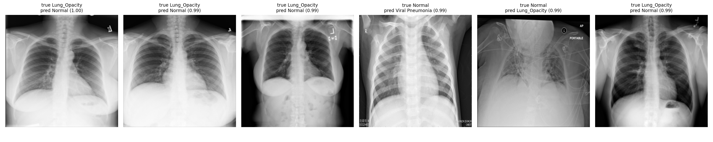
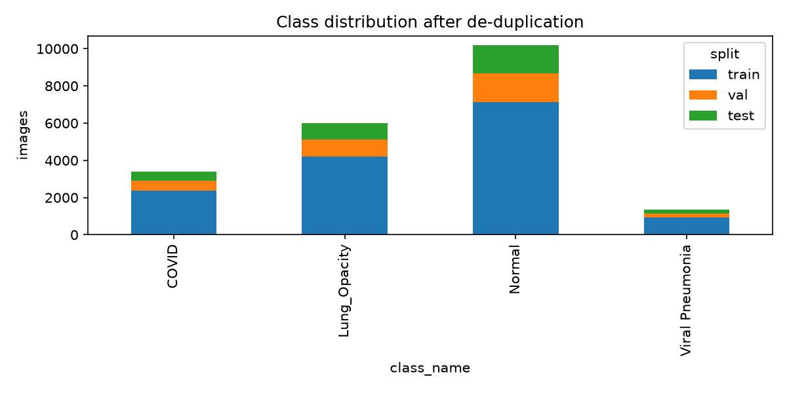

# COVID-19 Detection in Chest X-Rays — and How Much of It Is Real

A DenseNet121 classifier reaches **0.852 macro-F1** on a held-out test set of 3,142 chest radiographs, separating COVID-19 from Lung Opacity, Normal and Viral Pneumonia. That number is close to what a great many published notebooks report on this dataset.

**It is largely an artefact.** Blacking out the lungs entirely costs it 3% of that score. A multinomial logistic regression on a **64-pixel thumbnail** recovers three quarters of it. On the clinically meaningful comparison — COVID versus another adult lung opacity — the lungs-erased model performs *marginally better* than the model that can see them.

This repository is the measurement, not the classifier.

> **Not a medical device. Not for clinical use.** See [Limitations](#limitations).

---

## The finding

Four models, one code path, differing only in what the input contains. All figures are on the frozen test set, read once.

| Run | Input | macro-F1 | 95% CI | % of baseline |
|---|---|---|---|---|
| `run1_raw` | Full image | **0.8523** | [0.839, 0.866] | 100% |
| `run4_lungs_removed` | **Lungs erased** | **0.8288** | [0.813, 0.844] | **97.2%** |
| `run2_masked` | Lungs only | 0.7228 | [0.704, 0.741] | 84.8% |
| `run3_probe8` | **8×8 thumbnail, linear model** | **0.6417** | [0.622, 0.660] | **75.3%** |

Chance is 0.25. A majority-class predictor scores 0.13.

### The control pair

Averaging over four classes hides a confound: `Viral Pneumonia` in this dataset is **pediatric** — patients aged 1–5 from Kermany et al. — while COVID and Lung Opacity are adult. A model can separate those classes on ribcage size alone.

So every run is also scored **restricted to COVID vs. Lung Opacity**, both adult, both radiographic opacities. Age explains nothing here. Scores are renormalised over the pair rather than read off the four-way softmax.

| Run | Pair AUC | Pair accuracy |
|---|---|---|
| `run1_raw` | 0.9797 | 0.9222 |
| **`run4_lungs_removed`** | **0.9815** | 0.9137 |
| `run2_masked` | 0.8916 | 0.7870 |
| **`run3_probe8`** | **0.8102** | 0.7403 |

Two readings, both awkward:

**Erasing the lungs does not hurt.** 0.9815 without lungs against 0.9797 with them. On the one comparison that matters clinically, lung parenchyma contributes nothing measurable.

**A linear model on 64 pixels reaches AUC 0.81.** No mask, no age gap to exploit, no anatomy resolvable at 8×8 — each cell averages a 28×28 block, roughly a quarter of a hemithorax. Whatever separates COVID from Lung Opacity survives reduction to global intensity and framing. That is the signature of acquisition and processing differences between source repositories, not of pathology.

This rules out the obvious objection to `run4`. COVID's characteristic pattern is peripheral and subpleural — exactly where an imperfect segmentation boundary sits — so one might argue the lungs-erased model is reading genuine opacity that leaked past the mask edge. Subpleural consolidation is not visible in 64 pixels.

### The age confound, measured rather than argued

Per-class ROC-AUC for `Viral Pneumonia` — the pediatric class:

| Run | Viral Pneumonia ROC-AUC |
|---|---|
| `run1_raw` | 0.9983 |
| `run4_lungs_removed` | **0.9983** |
| `run3_probe8` (64 pixels) | 0.9840 |

**Identical with and without lungs**, and near-perfect from a 64-pixel thumbnail. A class defined by patient age is separable entirely from body habitus — ribcage proportions, scapular position, chest width — with no lung tissue involved at any point.

This is normally offered as a caveat about the dataset. Here it is a measurement, and it sets the scale for how much of the aggregate number these datasets can manufacture from anatomy that has nothing to do with disease.

### A fourth line of evidence, found before training

De-duplication turned up the same story in the raw data. Of 223 duplicate images removed from the 21,165-image pool:

| Class | Removed | Rate |
|---|---|---|
| COVID | **214** | **5.9%** |
| Viral Pneumonia | 7 | 0.5% |
| Normal | 2 | 0.02% |
| Lung Opacity | **0** | **0%** |

96% of all duplication is in one class. That is the dataset's assembly history made measurable: COVID images were gathered from 43 publications and the SIRM repository, where a striking case recurs across papers, while the controls arrived wholesale from RSNA. The classes differ in **provenance** before they differ in pathology.

---

## Results

Full table: [`reports/results.csv`](reports/results.csv) · raw metrics: [`reports/results.json`](reports/results.json)

| Run | macro-F1 | COVID sens. | COVID spec. | Spec @ 95% sens. | ECE | Pair AUC |
|---|---|---|---|---|---|---|
| `run1_raw` | 0.8523 | 0.6380 | 0.9958 | 0.8917 | 0.0352 | 0.9797 |
| `run2_masked` | 0.7228 | 0.4853 | 0.9552 | 0.5181 | 0.0454 | 0.8916 |
| `run3_probe8` | 0.6417 | 0.5519 | 0.8362 | 0.3071 | 0.0216 | 0.8102 |
| `run4_lungs_removed` | 0.8288 | 0.6204 | 0.9932 | 0.8985 | 0.0112 | 0.9815 |

### 97.2% is a floor, not a ceiling

`run4_lungs_removed` selected **epoch 15 of 15** — its last. It hit the epoch cap while still improving, and its final Stage B epoch was also its best. The baseline `run1_raw` peaked at epoch 12 and plateaued; `run2_masked` early-stopped at epoch 8 with its best at epoch 3.

So the lungs-erased model is the only one of the three that had not converged when training stopped. Its 97.2% of baseline is a lower bound on what that input can achieve, not an upper one.

### The headline metric hides the clinical one

**COVID sensitivity is 0.638.** The model that reports 0.85 macro-F1 **misses 36% of COVID cases** at argmax. Its specificity is 0.9958 — it is extremely reluctant to call COVID, which flatters aggregate accuracy while failing the requirement that actually matters. Reaching 95% sensitivity costs ~11% false positives.

Note also that `run4_lungs_removed` is the **best-calibrated** model of the four (ECE 0.0112 against 0.0352 for the baseline).



Row-normalised, counts overlaid. The crimson cells are COVID↔Lung Opacity — the two numbers carrying the audit.



### Replication

The training run was executed twice, independently, after a checkpoint was lost. The conclusion reproduces.

| Run | First (val) | Second (val) | Δ |
|---|---|---|---|
| `run1_raw` | 0.8568 | 0.8507 | −0.006 |
| `run2_masked` | 0.7519 | 0.7217 | −0.030 |
| `run3_probe8` | 0.6467 | **0.6467** | **0.000** |
| `run4_lungs_removed` | 0.8269 | 0.8274 | +0.001 |

The probe is bit-identical — scikit-learn on CPU with a fixed seed and a deterministic resize. The DenseNets drift by up to 0.03 despite identical seeding, because cuDNN algorithm selection, non-deterministic reductions and `tf.data` AUTOTUNE scheduling are not controlled by seeding alone. `run2_masked` drifts most, which is consistent with it having the least signal to latch onto.

**Seeded is not the same as reproducible to the digit.** Full determinism would need `TF_DETERMINISTIC_OPS=1` and a serialised input pipeline, at a real speed cost.

---

## Explainability

Grad-CAM is reported as a **number**, not only as heatmaps: the **Lung Attribution Ratio (LAR)** is the fraction of attribution mass falling inside the lung mask.

A bare LAR is uninterpretable, so it is bracketed by two measured reference points:

| | LAR | Meaning |
|---|---|---|
| Uniform attention | **0.238** | floor — mean lung mask coverage; what a model ignoring the image scores |
| `run1_raw` | **0.314** | [0.311, 0.318] |
| `run2_masked` | **0.376** | ceiling — a model that *cannot* see outside the lungs |

The baseline model sits **55% of the way from chance to the ceiling**. Above random — the confidence interval excludes 0.238 comfortably — but roughly half its attention advantage is not lung-directed.

**Why the ceiling is only 0.376.** Grad-CAM's native resolution here is 7×7; each cell covers a 32×32 pixel block, bilinearly upsampled to 224. Attribution cannot be confined to a lung-shaped region at that granularity. A model seeing nothing but black outside the lungs still "attributes" 62% of its mass there. **LAR is biased downward for every model**, which is why the comparison against a measured ceiling matters more than the absolute value.

This is the weakest of the four findings and is presented as corroboration, not proof. The probe, the lungs-erased result and the Viral Pneumonia AUC are load-bearing.

### The model is least lung-focused exactly where the decision is hard

Breaking LAR out by true class, against each class's own ceiling from `run2_masked`:

| Class | LAR (raw) | Ceiling | Fraction of the way from chance |
|---|---|---|---|
| **Lung Opacity** | 0.260 | 0.337 | **22%** |
| **COVID** | 0.288 | 0.376 | **36%** |
| Viral Pneumonia | 0.309 | 0.367 | 55% |
| Normal | 0.356 | 0.401 | 72% |

Floor is 0.238 throughout.

On `Normal` — where the call is easy and the lungs are unambiguously clear — the model is 72% of the way to the ceiling. On the two classes forming the control pair, where the clinically hard discrimination lives, it is at 36% and 22%: barely above a model that ignores the image.

Arrived at by a wholly different route from the pair-AUC result, and pointing the same way.





Original, then `run1_raw` and `run2_masked` attribution. Note the fifth column: a COVID case classified confidently while attention sits on the `D` positioning marker and the neck tubing — **LAR 0.04**. The sixth column attends to the image border, outside the body. Both of the lowest-LAR images carry visible positioning markers, the same shortcut the 8×8 probe detects numerically.

**A note on degenerate maps.** Five of 3,142 test images produced an all-zero Grad-CAM for `run1_raw` and are excluded from its mean as `NaN`. This is a genuine property of Grad-CAM on softmax outputs rather than a bug: `∂p_c/∂features` is positive for channels the target class reads but negative for those a competing likely class reads, so ReLU can clip the weighted sum to nothing. All five are Viral Pneumonia images.



Highest-confidence incorrect predictions, where shortcut reliance is most visible.

---

## Method

**Dataset.** [COVID-19 Radiography Database](https://www.kaggle.com/datasets/tawsifurrahman/covid19-radiography-database) — 21,165 images at 299×299, with lung segmentation masks at 256×256. Verified counts: COVID 3,616 · Lung Opacity 6,012 · Normal 10,192 · Viral Pneumonia 1,345.

**De-duplication.** MD5 over decoded pixels plus perceptual hashing at Hamming distance ≤ 1. The conventional threshold of ≤ 5 removed 1,529 images with 172 cross-label matches — visual inspection confirmed these were *different patients*. Chest radiographs are structurally uniform enough that a 64-bit DCT hash matches "frontal CXR" rather than image identity. At ≤ 1: 178 groups, 223 removals, zero cross-label. Details in [`src/covid_xray/dedup.py`](src/covid_xray/dedup.py).

**Splits.** Stratified 70/15/15 on 20,942 surviving images → 14,659 / 3,141 / 3,142. Manifests committed to [`data/splits/`](data/splits/) so the exact partition is reproducible from a clone. Test set created on day one, read once.



**Preprocessing.** 224×224 bilinear; masks nearest-neighbour. `keras.applications.densenet.preprocess_input`. The masked variant **zeroes** the background rather than cropping — cropping would introduce lung bounding-box size as a fresh shortcut.

**Augmentation.** Keras preprocessing layers, GPU-side: horizontal flip, ±14° rotation, ±10% zoom, ±5% translation, contrast 0.2, brightness 0.15. No vertical flips. Brightness and contrast jitter are deliberate — radiograph pixel values are relative and vary with exposure.

**Training.** ImageNet-pretrained DenseNet121. Stage A trains the head against a frozen base (lr 1e-3, ≤8 epochs); Stage B unfreezes 81 layers from `conv5_block1` (lr 1e-5, ≤15 epochs). **BatchNorm is held in inference mode throughout** — unfreezing it at batch size 32 silently degrades the model. Selection on validation macro-F1, not accuracy. Class imbalance (7:1) handled by per-sample weights only; stacking oversampling would distort the calibration analysis.

**Evaluation.** Bootstrap 95% CIs, 2,000 resamples. Per-class one-vs-rest ROC-AUC and PR-AUC. Specificity at fixed 95% COVID sensitivity. Expected calibration error.

Full design rationale: [`docs/superpowers/specs/`](docs/superpowers/specs/). Implementation plan: [`docs/superpowers/plans/`](docs/superpowers/plans/).

---

## Limitations

- **No patient identifiers exist in this dataset.** Patient-disjoint splitting is impossible. Near-duplicate removal is a partial mitigation — two radiographs of the same patient days apart will not be caught by a perceptual hash. **Every metric here is an upper bound.**
- **The lung masks are model-generated** by the dataset authors, not drawn by radiologists. Both the masked-model result and the LAR inherit that imperfection.
- **`run4` is not purely non-lung pixels.** It is `image × (1 − mask)`, so the erased region's silhouette encodes lung shape and size. If segmentation behaves differently on COVID images, the outline itself carries source information. `run3` has no such loophole — it touches no mask.
- **The four labels are not a clean partition of disease space.** A pediatric viral pneumonia *is* a lung opacity; COVID *is* a viral pneumonia. They are mutually exclusive only by provenance bookkeeping. `Lung Opacity` means "visible opacity, cause unspecified, not confirmed COVID" — RSNA's deliberately vague wording, because a radiograph often cannot reveal the cause.
- **Viral Pneumonia is pediatric** (ages 1–5, Kermany/Guangzhou) while COVID and Lung Opacity are adult. The control-pair analysis exists to work around this, not to fix it.
- **No external validation.** Generalisation to a new hospital is untested and, on this evidence, should not be assumed.
- **Grad-CAM at 7×7 cannot localise sharply.** See the ceiling discussion above.
- **Not a medical device. Not for clinical use.** Nothing here is validated for diagnosis.

---

## Reproducing

```bash
git clone https://github.com/Daniel-Chacha/covid-xray-detection.git
cd covid-xray-detection
python3 -m venv .venv && source .venv/bin/activate
pip install -r requirements.txt
python -m pytest -v          # 81 tests
```

Fetch the dataset:

```bash
kaggle datasets download -d tawsifurrahman/covid19-radiography-database -p data/raw --unzip
```

Notebooks in order:

| Notebook | Where | Runtime |
|---|---|---|
| [`01_eda_and_dedup.ipynb`](notebooks/01_eda_and_dedup.ipynb) | local, CPU | ~15 min (hashing 21k images) |
| [`02-train-evaluate-gradcam.ipynb`](notebooks/02-train-evaluate-gradcam.ipynb) | Kaggle, GPU T4 | ~3.5 hrs — training, then test-set evaluation and the Grad-CAM audit |

The second notebook does all three GPU stages in one session. That is deliberate: Kaggle discards `/kaggle/working` when a session ends unless a version is saved, and chaining notebooks through saved outputs is the step most likely to lose three hours of training.

The split manifests are committed, so `01` need not be re-run to reproduce the partition. Choose **T4 over P100** — P100 has no tensor cores, so the `mixed_float16` policy buys nothing there.

Two environment caveats. The `.keras` checkpoints and `run3_probe8.joblib` are gitignored — regenerating them means re-running the training notebook. And the probe was pickled under scikit-learn 1.6.1 on Kaggle; loading it under a different minor version raises `InconsistentVersionWarning`. It loads and predicts correctly, but pickled estimators are not a version-portable format, which is why every number in this README is also written to [`reports/results.json`](reports/results.json).

---

## Repository layout

```
src/covid_xray/
├── config.py      # RunConfig; one YAML per experiment
├── dedup.py       # MD5 + perceptual hashing, threshold justification in the docstring
├── splits.py      # stratified split, manifest I/O
├── data.py        # tf.data pipeline, the four input variants
├── augment.py     # augmentation stack
├── models.py      # DenseNet121 builder, 8x8 probe, feature/head split
├── train.py       # two-stage loop, macro-F1 selection
├── evaluate.py    # metrics, bootstrap CIs, control-pair analysis
└── gradcam.py     # Grad-CAM, Lung Attribution Ratio
```

81 tests. Notebooks hold orchestration and figures only.

---

## References

- Chowdhury et al. — [COVID-19 Radiography Database](https://www.kaggle.com/datasets/tawsifurrahman/covid19-radiography-database)
- DeGrave, Janizek & Lee (2021) — [AI for radiographic COVID-19 detection selects shortcuts over signal](https://www.nature.com/articles/s42256-021-00338-7), *Nature Machine Intelligence*
- Kermany et al. — pediatric chest X-ray dataset (source of the Viral Pneumonia class)
- [RSNA Pneumonia Detection Challenge](https://www.kaggle.com/c/rsna-pneumonia-detection-challenge) — source of Normal and Lung Opacity
- [On the Composition and Limitations of Publicly Available COVID-19 X-Ray Imaging Datasets](https://arxiv.org/abs/2008.11572)
